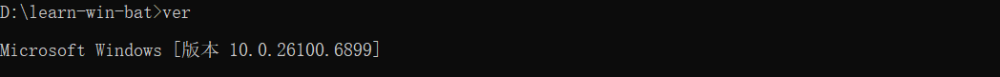
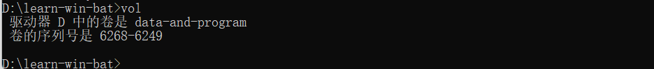
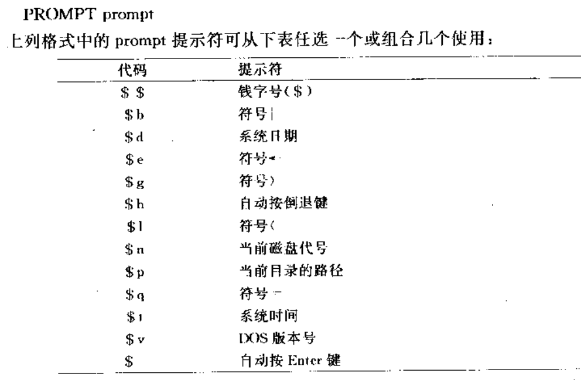
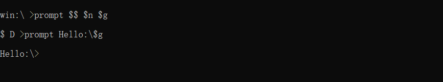
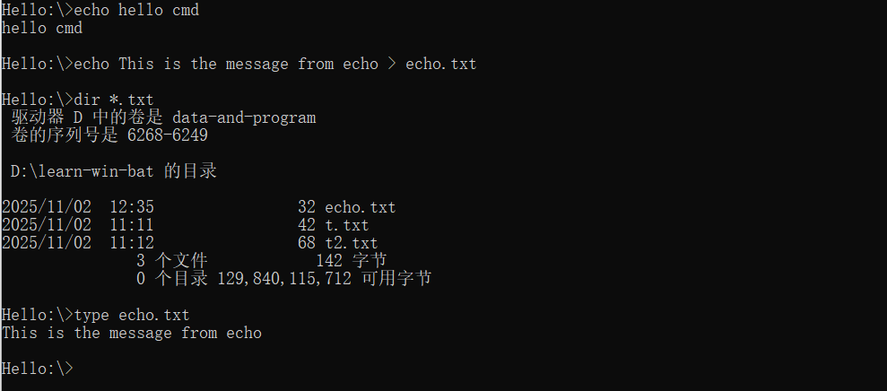

## useful win  commands
#### 1.cls 清理屏幕的目录

~~~dos
cls
~~~


####  2.dir显示当前驱动器或者文件夹里面的目录和文件

~~~dos
dir 
dir *.txt
dir c:\windows
dir c:\windows /w /p

~~~

#### 3.type 显示文本文件的内容

```dos
type 文件名
type t.txt
```


#### 4.copy拷贝文件

```dos
copy a.bat b.bat
copy a.txt b.txt /v 参数/v是用来检查拷贝有没有错误
合并拷贝:把多个文件的内容合并起来然后拷贝到一个文件在
copy *.txt total.txt
copy con: x.txt 在命令行在新建一个文本文件x.txt并且进入编辑模式,编辑完后可以按ctrl+z,然后回车退出
copy t.txt con: 显示t.txt的内容
注意: 上面的命令中的con: 在cmd窗口是有的,在powershell命令窗口中是没有的.
```

#### 5.ren (rename)文件重命名

```dos
ren file1.txt file.txt
```


#### 6.del (erase)删除指定的文件

```dos
del welcome.txt
# 删除指定文件夹里面的所有文件
del test 就是删除test文件夹里面的使用文件,test文件夹保留,相当于del D:\learn-win-bat\test\*,因为这里test文件夹是D:\learn-win-bat文件夹的子文件夹
erase file1.txt 删除文件file1.txt
del *.* 删除当前目录下面的所有文件
del *.bas /p 删除所有以bas结尾的文件,并且需要你确认.
```

#### 7.date重新设置系统日期,会先显示当前系统日期,然后等待你输入新日期


#### 8.time重新设置当前日期,会先显示当前日期,然后等待你输入新日期,如果不输入,直接按回车


#### 9. ver显示当前windows操作系统的版本



#### 10.vol显示磁盘卷标信息



#### prompt用来设置命令提示符格式

##### 可选格式如下





#### 11.comp比较两个文件的大小是否相同


#### 12.chkdsk检查磁盘是否ok


##### 从结果上看,这个d盘是good的

#### 13. recover可以恢复损坏的文件

## win batch command

#### 1>echo可以显示文本到控制台上面,也可以输出到文件

```batch
echo hello
echo This is the message from echo > echo.txt创建一个把内容输出到echo.txt文件中
```



##### echo脚本实例echotest.bat

```win batch
echo echo test sample
echo off
dir *.bat
echo
echo on
echo
dir *.bat
```

###### ###### 效果


#### 2>rem批处理文件里面的注释

#### 3>pause暂停批处理文件的执行

###### 小例子:testpause.bat

```win batch
dir 
pause
dir c:\windows
```

###### 效果


